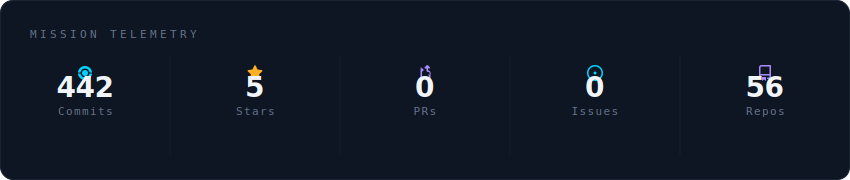

  

 

  

 

  

 

  

 

---

## 📌 Outros Projetos de Destaque

Além dos repositórios destacados na galáxia acima, desenvolvi diversos sistemas de gestão, catálogos e aplicativos focados em UX e integração:

| Projeto | Descrição | Tecnologias | Links |
| :--- | :--- | :--- | :--- |
| **LogicSales** | App híbrido para força de vendas. Facilita o processo comercial com interface imersiva. | React Native, Expo, PostgreSQL | [Ver no Figma](https://www.figma.com/design/OCEnCituKthn1SViXZpgWP/LogicSales) |
| **UBS Inventário** | Sistema completo de inventário e suporte para a SEMUS de Bacabal. | React, TypeScript, Vite, Node.js | [Acessar App](https://gestortibacabal.netlify.app/) |
| **Hemolab Showcase** | Landing page para imersão sobre Inteligência Artificial com foco em gestão. | Next.js, Framer Motion, Three.js | [Acessar App](https://hemolab-showcase.vercel.app/) \| [GitHub](https://github.com/samueldng/hemolab-showcase) |
| **Catálogo Morais** | Catálogo online integrado ao WhatsApp para orçamentos automáticos rápidos. | Next.js, Tailwind CSS, Prisma | [Acessar App](https://moraisdistribuidora.vercel.app/) \| [GitHub](https://github.com/samueldng/logicsales-web) |
| **MaintQR** | Plataforma de gestão de ativos e serviços de manutenção baseada em QR Codes. | React, Node.js, Supabase | [Acessar App](https://frostserviceapp.vercel.app/) \| [GitHub](https://github.com/samueldng/Service_App) |

 

---

## 🏅 Certificações & Formação

  <table>
    <tr>
      <td align="center" width="220">
        
         
         
        <strong>Postman Student Expert</strong>
      </td>
       <td align="center" width="220">
        
         
         
        <strong>Programação Python</strong> 
        <small>Concluído (2025)</small>
      </td>
      <td align="center" width="220">
        
         
         
        <strong>Introdução a IA Generativa</strong> 
        <small>Concluído (2025)</small>
      </td>
    </tr>
  </table>

